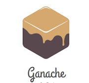

# **Real Estate Prediction with Blockchain Technology**

 

 

## Description

This project intends to predict future California home prices to give potential investors buying opportunities, using Ethereum. For our dataset, we used Kaggle to obtain data on various metrics regarding California homes. We next used multiple Machine Learning methods in order to evaluate the best model for predicting future home prices.  Lastly, we utilized Blockchain Technology along with Streamlit to create an interactive web application for investors.

 
 

## Data Analyzed

The California Housing dataset, which is commonly used for machine learning and statistics, derives from the 1990 US census. It was initially published in 1990 by Pace, R. Kelley and Ronald Barry and is available on the UCI Machine Learning Repository. This dataset contains information about the economic and geographic characteristics of houses, as well as the economic status of residents in California.

 

The California housing dataset provides data on a range of socio-economic characteristics of block groups located in California. Each row in the dataset represents a block group, and there are 20,640 observations, each comprising 10 attributes. The dataset includes the following features:

 

- **Housing Median Age:** The median age of the housing units in each block group.
- **Households:** The total number of households in the block group.
- **Latitude:** The latitude of the center of each block group in California.
- **Longitude:** The longitude of the center of each block group in California.
- **Median House Value:** The median value of the housing units in the block group.
- **Median Income:** The median income of the block group.
- **Ocean Proximity:** The proximity of the block group to the ocean or other bodies of water.
- **Population:** The total population of the block group.
- **Total Bedrooms:** The total number of bedrooms in the housing units in each block group.
- **Total Rooms:** The total number of rooms in the housing units in each block group.

 
 

## **Machine Learning Models**

* ***Linear Regression***

* ***K Nearest Neighbors*** 

* ***Random Forest***

* ***Gradient Boosting Regressor***

* ***Neural Networks***

 
 

## Machine Learning Results
(Results here)

## Challenges

We were unable to achieve a high accuracy score amongst all of our models. 

 
 

## **Blockchain Requirements**

- **Crypto Wallet:** Investors must own a digital wallet that holds funds in the form of Ethereum cryptocurrency. A crypto wallet is a software application that stores public and private keys used for sending, receiving, and storing digital assets like cryptocurrencies.

 

- **Ganache:** Ganahce is the source of Cryptocurrency Funds, and is used to create a local blockchain network that mimics the main Ethereum network. This allows for testing and experimenting with applications in a secure environment without spending real cryptocurrency.

 

- **Streamlit:** Streamlit is a Web Application that allows users to create interactive data visualizations, web applications, and machine learning models. We used Streamlit to create a user-friendly interface for potential investors to view the properties and execute transactions using Ethereum cryptocurrency.

 
 

## Blockchain Results

 
 

## Conclusion

## Made Using:
* [Blockchain](https://www.blockchain.com/) - Digital Ledger
* [Conda](https://docs.conda.io/en/latest/) - Package Manager
* [Ethereum](https://ethereum.org/en/) - Cryptocurrency
* [Hvplot](https://hvplot.holoviz.org/) - Data Visualization in Pandas
* [Kaggle](https://www.kaggle.com/) - Real Estate Data
* [Matplotlib](https://hvplot.holoviz.org/) - Data Visualization
* [Numpy](https://numpy.org/) - Array Library
* [Pandas](https://pandas.pydata.org/) - Data Analysis
* [Pathlib](https://plotly.com/python/) - Python module for paths
* [Prophet](https://facebook.github.io/prophet/) - Forecasting Machine Learning Library
* [Python](https://docs.python.org/3/library/) - Programming Language
* [Scikit-Learn](https://scikit-learn.org/stable/) - Machine Learning
* [Seaborn](https://seaborn.pydata.org/)  - Visualization library
* [Streamlit](https://streamlit.io/) - Building Data Application
* [Tensor-Flow](https://www.tensorflow.org/) - Deep Learning

## Project Contributors

* **Gabriel Millan** : [LinkedIn](https://www.linkedin.com/in/millangabriel/) | [Github](https://github.com/gjmillan)

* **Tim Clemens** : [Github](https://github.com/AmericanHacker)

* **Brandon Latherow** : [LinkedIn](https://www.linkedin.com/in/brandon-latherow-4703a9214/) | [Github](https://github.com/brandonlatherow)
